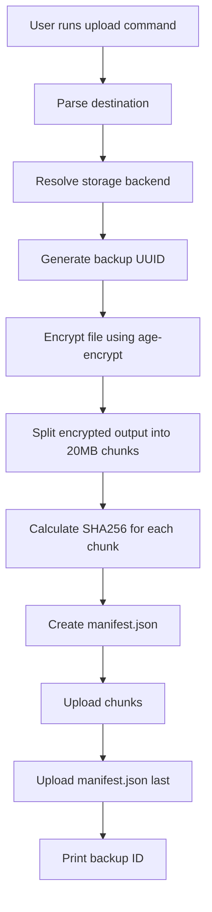
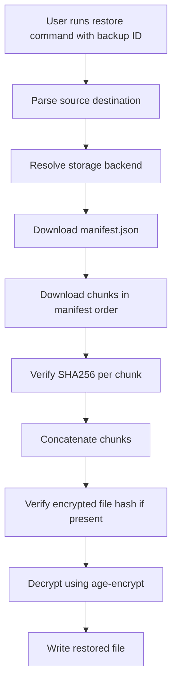

# Feature Spec: SecureBackup CLI

## Summary

SecureBackup is a Bun-based single-binary CLI for encrypting files with `age-encrypt`, splitting the encrypted output into fixed-size chunks, and uploading those chunks to pluggable storage backends. The primary goal is to make cloud storage safer by ensuring providers only receive encrypted chunk data, never plaintext files.

The project root is expected to be:

```text
~/securebackup
```

Telegram support is intentionally out of scope for the initial design.

---

## Goals

- Build a Bun CLI that can be compiled into one binary.
- Encrypt files using the `age-encrypt` library.
- Split encrypted output into 20MB chunks by default.
- Store each backup under a UUID-based folder instead of the original filename.
- Generate a `manifest.json` that maps the backup UUID to file metadata and chunk metadata.
- Support pluggable storage backends.
- Start with practical storage support instead of trying to support every cloud provider natively.
- Upload `manifest.json` last so incomplete backups are not treated as complete.
- Support restore by downloading chunks, verifying checksums, concatenating, and decrypting.

---

## Non-Goals

- No Telegram backend in the initial version.
- No native Google Drive, Dropbox, Mega, Pixeldrain, or MediaFire support in the first version.
- No custom cryptography design.
- No hand-rolled encryption format.
- No private key storage in cloud manifests.
- No multi-user collaboration.
- No web UI.
- No server component required for MVP.

---

## Core Design

The app follows this upload pipeline:

```text
File asli
  ↓
Encrypt using age-encrypt
  ↓
Encrypted temporary file/blob
  ↓
Split into 20MB chunks
  ↓
Hash each chunk
  ↓
Generate manifest.json
  ↓
Upload chunks to storage backend
  ↓
Upload manifest.json last
```

Restore pipeline:

```text
Backup UUID
  ↓
Download manifest.json
  ↓
Download chunks in order
  ↓
Verify chunk SHA256 hashes
  ↓
Concatenate chunks into encrypted file/blob
  ↓
Decrypt using age-encrypt
  ↓
Write original file
```

---

## Recommended MVP Storage Backends

Initial support should focus on broad coverage with low implementation pain.

### v0.1

- Local filesystem backend.

### v0.2

- S3-compatible backend.
  - AWS S3
  - Cloudflare R2
  - MinIO
  - Wasabi
  - DigitalOcean Spaces
  - Backblaze B2 S3-compatible API

### v0.3

- Rclone backend.
  - Google Drive
  - Dropbox
  - Mega
  - OneDrive
  - SFTP
  - WebDAV
  - Many others through existing rclone remotes

Native provider support can come later only if there is enough demand.

---

## Destination URI Design

The `upload` command should not hardcode one provider. It should accept a generic destination string:

```bash
securebackup upload ./file.zip --to <destination>
```

Examples:

```bash
securebackup upload ./file.zip --to local:/mnt/backups
securebackup upload ./file.zip --to s3://my-bucket/backups
securebackup upload ./file.zip --to rclone:gdrive:/EncryptedBackups
securebackup upload ./file.zip --to rclone:dropbox:/SecureBackups
```

Restore should mirror the same pattern:

```bash
securebackup restore <backup_id> --from <destination>
```

Examples:

```bash
securebackup restore 7f91c6c7-7a0b-44aa-ae23-997b60e4e998 \
  --from local:/mnt/backups \
  --identity ./key.txt
```

```bash
securebackup restore 7f91c6c7-7a0b-44aa-ae23-997b60e4e998 \
  --from rclone:gdrive:/EncryptedBackups \
  --identity ./key.txt
```

---

## Storage Layout

All filesystem-like backends should use the same layout:

```text
{root}/
  {backup_id}/
    manifest.json
    chunks/
      000000.chunk
      000001.chunk
      000002.chunk
```

Example:

```text
/backups/
  7f91c6c7-7a0b-44aa-ae23-997b60e4e998/
    manifest.json
    chunks/
      000000.chunk
      000001.chunk
      000002.chunk
```

The original filename must not be used as the remote folder name. The folder name should be a UUID.

---

## Manifest Format

Recommended MVP manifest:

```json
{
  "version": 1,
  "backup_id": "7f91c6c7-7a0b-44aa-ae23-997b60e4e998",
  "created_at": "2026-05-14T00:45:00.000Z",
  "app": {
    "name": "securebackup",
    "version": "0.1.0",
    "runtime": "bun"
  },
  "source": {
    "original_filename": "backup.tar",
    "original_size": 4294967296
  },
  "encryption": {
    "format": "age",
    "library": "age-encrypt",
    "mode": "recipient",
    "recipient": "age1xxxxxxxxxxxxxxxx"
  },
  "chunking": {
    "chunk_size": 20971520,
    "total_chunks": 205
  },
  "integrity": {
    "encrypted_file_sha256": "optional-sha256-of-concatenated-encrypted-file"
  },
  "storage": {
    "backend": "local",
    "layout": "filesystem-v1"
  },
  "chunks": [
    {
      "index": 0,
      "name": "000000.chunk",
      "size": 20971520,
      "sha256": "..."
    },
    {
      "index": 1,
      "name": "000001.chunk",
      "size": 20971520,
      "sha256": "..."
    }
  ]
}
```

### Privacy Note

The UUID folder prevents the original filename from leaking through the remote path. However, if `manifest.json` is plaintext, it can still reveal:

- original filename
- original file size
- created timestamp
- number of chunks
- recipient public key

For MVP, plaintext manifest is acceptable. A future version may support encrypted metadata inside the manifest.

---

## Backend Abstraction

The upload and restore commands should not care which storage provider is being used. They should call a storage abstraction.

Minimal MVP interface:

```ts
type StorageBackend = {
  uploadFile(localPath: string, remotePath: string): Promise<void>
  downloadFile(remotePath: string, localPath: string): Promise<void>
  exists(remotePath: string): Promise<boolean>
  list(prefix: string): Promise<string[]>
}
```

Later versions may move toward streaming:

```ts
type StorageBackend = {
  putObject(path: string, data: ReadableStream): Promise<void>
  getObject(path: string): Promise<ReadableStream>
  exists(path: string): Promise<boolean>
  list(prefix: string): Promise<RemoteObject[]>
  deleteObject(path: string): Promise<void>
}
```

MVP should prefer the simpler file-based interface first. Streaming can come later after the core flow works.

---

## Project Structure

The project root should be:

```text
~/securebackup
```

Recommended structure:

```text
securebackup/
  FEATURE_SPEC.md
  package.json
  bun.lock
  src/
    cli.ts
    commands/
      upload.ts
      restore.ts
      list.ts
      verify.ts
      storage.ts
    core/
      encrypt.ts
      decrypt.ts
      chunk.ts
      manifest.ts
      checksum.ts
      ids.ts
      paths.ts
    storage/
      local.ts
      s3.ts
      rclone.ts
      types.ts
    config/
      config.ts
      profiles.ts
```

---

## CLI Commands

### Upload

```bash
securebackup upload ./backup.tar \
  --recipient age1xxxx \
  --to local:/mnt/backups
```

Expected behavior:

1. Generate a UUID backup ID.
2. Encrypt the input file using `age-encrypt`.
3. Split encrypted output into 20MB chunks.
4. Hash each chunk with SHA256.
5. Build `manifest.json`.
6. Upload chunks to `{root}/{backup_id}/chunks/`.
7. Upload `manifest.json` last.
8. Print the backup ID.

Example output:

```text
Backup uploaded successfully.

Backup ID:
7f91c6c7-7a0b-44aa-ae23-997b60e4e998

Original file:
backup.tar

Chunks:
205

Remote:
local:/mnt/backups/7f91c6c7-7a0b-44aa-ae23-997b60e4e998
```

### Restore

```bash
securebackup restore 7f91c6c7-7a0b-44aa-ae23-997b60e4e998 \
  --from local:/mnt/backups \
  --identity ./key.txt \
  --output ./restored/
```

Expected behavior:

1. Download `manifest.json`.
2. Download chunks listed in the manifest.
3. Verify each chunk SHA256.
4. Concatenate chunks in index order.
5. Optionally verify `encrypted_file_sha256` if present.
6. Decrypt with `age-encrypt`.
7. Write output file using the original filename unless overridden.

### List

```bash
securebackup list --from local:/mnt/backups
```

Expected behavior:

- List backup UUIDs found under the target storage root.
- Optionally read manifest metadata for display.

### Verify

```bash
securebackup verify 7f91c6c7-7a0b-44aa-ae23-997b60e4e998 \
  --from local:/mnt/backups
```

Expected behavior:

- Download or inspect all chunks.
- Verify chunk presence.
- Verify chunk sizes.
- Verify SHA256 hashes.
- Report whether the backup is restorable.

### Storage Profiles

Direct destination URIs are useful for advanced users, but named profiles improve UX.

Example:

```bash
securebackup storage add rclone gdrive-backup \
  --remote gdrive \
  --path /EncryptedBackups
```

Then:

```bash
securebackup upload ./backup.tar --to gdrive-backup
securebackup restore <backup_id> --from gdrive-backup --identity ./key.txt
```

Possible config shape:

```json
{
  "storages": {
    "gdrive-backup": {
      "backend": "rclone",
      "remote": "gdrive",
      "path": "/EncryptedBackups"
    },
    "local-main": {
      "backend": "local",
      "path": "/mnt/backups"
    },
    "r2-main": {
      "backend": "s3",
      "bucket": "my-backups",
      "prefix": "securebackup",
      "endpoint": "https://example.r2.cloudflarestorage.com",
      "region": "auto"
    }
  }
}
```

Secrets should not be stored directly in plaintext config if avoidable. Prefer environment variables, OS keychain, or backend-native config such as rclone config.

---

## Upload Flow Diagram



---

## Restore Flow Diagram



---

## Chunking Rules

- Default chunk size: `20MB` / `20 * 1024 * 1024` bytes.
- Chunk names must be fixed-width numeric filenames:

```text
000000.chunk
000001.chunk
000002.chunk
```

- The last chunk may be smaller than 20MB.
- Chunks must be restored strictly by `index`, not by lexicographic guessing alone.
- Each chunk must have a SHA256 checksum in the manifest.

---

## Encryption Rules

- Use `age-encrypt`.
- Prefer recipient/public-key mode for backups.
- Do not invent custom cryptographic schemes.
- Do not encrypt chunks independently in MVP.
- Recommended order is:

```text
encrypt full file → split encrypted output
```

- Private keys must never be uploaded as part of the backup.

---

## Temporary File Strategy

MVP should use temporary files instead of full streaming.

```text
input file
  ↓
encrypted temp file
  ↓
chunk files
  ↓
upload
```

Pros:

- easier implementation
- easier retry/debugging
- easier checksum calculation
- simpler restore flow

Cons:

- requires extra local disk space
- less elegant for huge files

Streaming encryption/chunk/upload can be a future optimization.

---

## Error Handling

The CLI should handle:

- input file does not exist
- destination URI cannot be parsed
- unsupported backend
- missing rclone binary for rclone backend
- invalid S3 credentials
- upload failure
- partial upload
- missing manifest
- missing chunk
- checksum mismatch
- decryption failure
- insufficient disk space for temp files
- output file already exists

For failed uploads, the app should avoid uploading a final `manifest.json` unless all chunks are uploaded successfully.

---

## Acceptance Criteria

- [ ] Project root exists at `~/securebackup`.
- [ ] CLI can be built with Bun into a binary.
- [ ] `upload` accepts an input file, recipient, and destination.
- [ ] `upload` encrypts using `age-encrypt`.
- [ ] `upload` splits encrypted output into 20MB chunks by default.
- [ ] Chunks are named with fixed-width numeric names.
- [ ] A UUID is used as the remote backup folder name.
- [ ] `manifest.json` includes `backup_id`, source metadata, encryption metadata, chunking metadata, and per-chunk checksums.
- [ ] Chunks are uploaded before `manifest.json`.
- [ ] `restore` can reconstruct and decrypt a backup from chunks.
- [ ] `verify` detects missing chunks.
- [ ] `verify` detects checksum mismatches.
- [ ] Local backend works.
- [ ] S3-compatible backend works in a later milestone.
- [ ] Rclone backend works in a later milestone.
- [ ] Telegram support is not included in the initial implementation.

---

## Roadmap

### v0.1

- Bun CLI scaffold.
- Single binary build.
- Local backend.
- Upload command.
- Restore command.
- Verify command.
- UUID backup folders.
- Manifest generation.
- 20MB chunking.
- `age-encrypt` integration.

### v0.2

- S3-compatible backend.
- Storage profiles.
- Better config handling.
- Resume upload basics.

### v0.3

- Rclone backend.
- Support many providers indirectly through rclone.
- Better list output.
- Better error messages.

### v0.4+

- Optional native provider integrations based on real demand.
- Possible encrypted manifest metadata.
- Streaming pipeline.
- Parallel chunk upload.
- More advanced resume support.

---

## Agent Instructions

- Implement only the behavior described in this spec.
- Treat `~/securebackup` as the project root.
- Keep Telegram support out of the initial implementation.
- Do not add a web UI, server, database, or native provider integrations unless explicitly requested.
- Start with local backend before S3 or rclone.
- Prefer simple, testable file-based processing before streaming.
- Do not invent cryptography. Use `age-encrypt`.
- Upload `manifest.json` only after all chunks are uploaded successfully.
