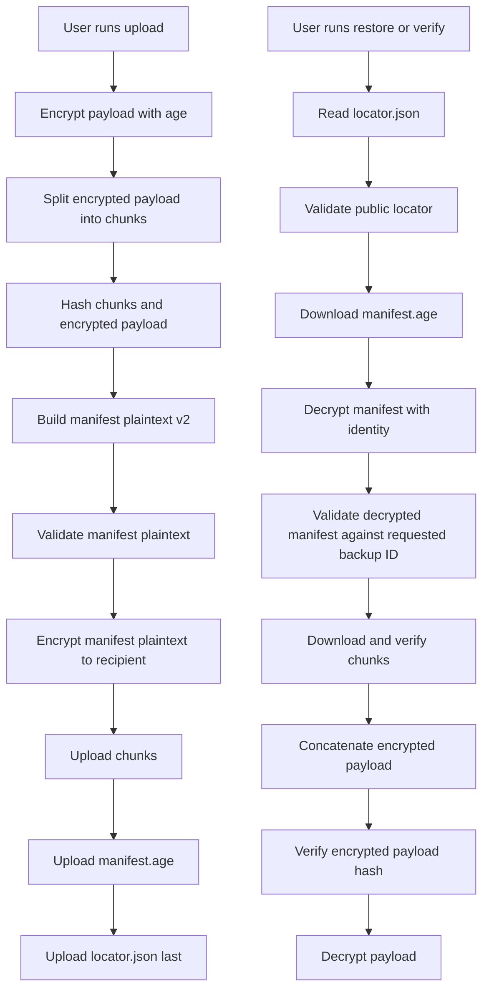

# Feature Spec: Encrypted Manifest v2

## Summary

SecureBackup should replace plaintext `manifest.json` metadata with an age-encrypted manifest envelope. The goal is metadata privacy on untrusted backup storage while preserving the existing chunked backup layout and restore workflow.

This design intentionally prioritizes **metadata privacy** over writer provenance. It prevents storage providers and casual readers from seeing filenames, sizes, recipients, and chunk hashes, but it does not prove which trusted local machine created the manifest. That trade-off is explicit, because pretending encrypted metadata is the same as signed metadata is how security documents become fan fiction.

## Goals

- Encrypt sensitive manifest metadata with age recipient encryption.
- Keep backup discovery simple: each backup still has a UUID folder and a public locator file.
- Preserve existing chunk layout under `{backup_id}/chunks/*.chunk`.
- Require manifest decryption before restore/verify can use backup metadata.
- Bind the decrypted manifest to the requested backup ID and storage layout via strict validation.
- Keep compatibility path for v1 plaintext manifests during migration, if desired.

## Non-Goals

- No asymmetric signing in this feature.
- No writer/auditor identity proof.
- No custom cryptographic format.
- No hand-rolled encryption or MAC.
- No attempt to hide backup UUIDs, chunk object names, or total bytes visible from storage object listing.
- No remote key management service.
- No multi-recipient policy UI beyond what age recipient encryption already supports.

## Users / Actors

- **User:** Uploads, verifies, and restores encrypted backups.
- **SecureBackup CLI:** Encrypts/decrypts payloads and manifests, validates metadata, and reads/writes storage objects.
- **Storage backend:** Stores opaque chunks plus encrypted manifest envelope.
- **Attacker / malicious storage provider:** Can read, delete, replay, or modify stored objects but does not possess the user's age identity private key.

## Threat Model

### Protects Against

- Storage backend reading original filename, file size, recipient, chunk hashes, and timestamps from plaintext manifest.
- Storage backend tampering with manifest JSON fields without causing age decryption/authentication failure.
- Path traversal via metadata fields before decryption/validation.
- Accidental metadata disclosure through copied backup directories.

### Does Not Fully Protect Against

- Deletion of backups or chunks.
- Replay of an older valid encrypted manifest/payload pair unless additional anti-replay state is stored locally.
- Replacement with another valid backup encrypted to the same recipient, if the attacker can produce such a backup.
- Proof of creator identity. Use signed manifests later if provenance matters.
- Traffic/size analysis from object names, object count, and chunk sizes.

## Storage Layout

Version 2 should use this layout:

```text
{root}/
  {backup_id}/
    manifest.age
    locator.json
    chunks/
      000000.chunk
      000001.chunk
```

### `locator.json`

`locator.json` is public, minimal, and non-sensitive. It exists so tools can identify the backup format without decrypting metadata.

```ts
type PublicLocatorV2 = {
  version: 2
  app: "securebackup"
  backup_id: string
  manifest: {
    name: "manifest.age"
    encryption: "age"
  }
  storage: {
    layout: "filesystem-v2"
  }
}
```

Rules:

- `locator.json` must not contain original filename, original size, recipient, chunk hashes, encrypted payload hash, or timestamps unless explicitly accepted as public metadata.
- Upload must write chunks first, then `manifest.age`, then `locator.json` last.
- A backup is considered complete only when `locator.json` exists and validates.

## Encrypted Manifest Format

The plaintext manifest is serialized as canonical JSON and then encrypted with age.

```ts
type EncryptedManifestPlaintextV2 = {
  version: 2
  backup_id: string
  created_at: string
  app: {
    name: "securebackup"
    version: string
    runtime: "bun"
  }
  source: {
    original_filename: string
    original_size: number
  }
  payload: {
    encryption: {
      format: "age"
      library: "age-encryption"
      mode: "recipient"
      recipients: string[]
    }
    encrypted_file_sha256: string
  }
  manifest_encryption: {
    format: "age"
    library: "age-encryption"
    mode: "recipient"
    recipients: string[]
  }
  chunking: {
    chunk_size: number
    total_chunks: number
  }
  storage: {
    backend: string
    layout: "filesystem-v2"
  }
  chunks: Array<{
    index: number
    name: string
    size: number
    sha256: string
  }>
}
```

## Flow Diagram



## Main Flow: Upload

1. User runs `securebackup upload <file> --to <destination> --recipient <recipient-file>`.
2. CLI validates input file, recipient, destination, and chunk size.
3. CLI generates UUID v4 `backup_id`.
4. CLI encrypts the payload with age using the payload recipients.
5. CLI splits the encrypted payload into bounded fixed-size chunks.
6. CLI computes chunk SHA-256 hashes and encrypted payload SHA-256 hash.
7. CLI builds plaintext manifest v2.
8. CLI validates plaintext manifest v2 before encryption.
9. CLI encrypts manifest JSON using age to produce `manifest.age`.
10. CLI uploads chunks to `{backup_id}/chunks/`.
11. CLI uploads `manifest.age`.
12. CLI uploads `locator.json` last.
13. CLI reports backup ID and destination.

## Main Flow: Verify

1. User runs `securebackup verify <backup_id> --from <destination> --identity <identity-file>`.
2. CLI validates `backup_id` as UUID v4.
3. CLI downloads and validates `locator.json`.
4. CLI downloads `manifest.age`.
5. CLI decrypts `manifest.age` with the identity.
6. CLI validates decrypted manifest v2.
7. CLI confirms `manifest.backup_id === requested backup_id`.
8. CLI downloads each listed chunk.
9. CLI verifies size and SHA-256 for every chunk.
10. CLI concatenates chunks in temp storage and verifies encrypted payload SHA-256.
11. CLI reports success/failure.

## Main Flow: Restore

1. User runs `securebackup restore <backup_id> --from <destination> --identity <identity-file> --output <path>`.
2. CLI performs the verify flow through encrypted payload hash verification.
3. CLI decrypts encrypted payload with age.
4. If output is a directory, CLI uses only a validated safe `manifest.source.original_filename`.
5. CLI writes the restored file with restrictive permissions.
6. CLI reports final output path.

## Functional Requirements

- The system must write `manifest.age` instead of plaintext `manifest.json` for v2 backups.
- The system must write `locator.json` last and treat it as the completion marker.
- The system must encrypt manifest metadata using age recipient encryption.
- The system must validate manifest plaintext before encryption and after decryption.
- The system must reject v2 restore/verify without an identity capable of decrypting `manifest.age`.
- The system must reject decrypted manifests where `backup_id` does not match the requested backup ID.
- The system must reject unsafe `source.original_filename` values after manifest decryption.
- The system must reject chunk names that do not match `^\d{6}\.chunk$`.
- The system must reject duplicate chunk names or indexes.
- The system must reject chunk indexes that are not contiguous from zero.
- The system must verify chunk hashes before decrypting payload data.
- The system must verify concatenated encrypted payload hash before decrypting payload data.
- The system must not store private identity material in storage.
- The system must not expose plaintext manifest content in logs or normal CLI output.

## Alternate / Error Flows

### Missing `locator.json`

1. User runs verify/restore.
2. CLI cannot find `locator.json`.
3. CLI may attempt v1 plaintext manifest compatibility only if legacy support is enabled.
4. Otherwise CLI reports incomplete or unsupported backup.

### Manifest decryption fails

1. CLI downloads `manifest.age`.
2. Age decryption fails.
3. CLI stops before downloading chunks.
4. CLI reports that the identity cannot decrypt the manifest or the manifest is corrupted.

### Manifest validates but chunks are missing

1. CLI decrypts and validates manifest.
2. One or more listed chunks are missing.
3. CLI reports missing chunk names.
4. CLI does not attempt payload decryption.

### Encrypted payload hash mismatch

1. CLI verifies each chunk successfully.
2. CLI concatenates chunks.
3. Encrypted payload SHA-256 does not match manifest.
4. CLI rejects restore and deletes temp files.

### Unsafe restore filename

1. Manifest decrypts successfully.
2. `source.original_filename` contains `/`, `\`, NUL, `.`, `..`, or a drive prefix.
3. CLI rejects restore unless user provided an explicit output file path.

## Migration / Compatibility

- Existing v1 plaintext backups may remain readable through a legacy path.
- New uploads should default to v2 encrypted manifests.
- Optional CLI flag:

```bash
securebackup upload ./file --to local:/backups --manifest-format v2
```

- If legacy support is kept, `verify`/`restore` should clearly report whether a backup is v1 plaintext or v2 encrypted.
- `VULNERABILITIES.md` should keep SB-VULN-004 marked as residual for v1 backups.

## Implementation Notes

Suggested module split:

```text
src/core/manifest-v2.ts       # v2 types, validation, canonical serialization
src/core/manifest-crypto.ts   # encrypt/decrypt manifest.age
src/core/locator.ts           # locator.json type + validation
src/commands/upload.ts        # write v2 layout by default
src/commands/verify.ts        # read locator, decrypt manifest, verify chunks
src/commands/restore.ts       # restore through v2 verified manifest
```

Recommended public files:

```text
locator.json       # public metadata only
manifest.age       # encrypted metadata
chunks/*.chunk     # encrypted payload chunks
```

Canonicalization:

- Use deterministic JSON serialization for manifest plaintext before encryption if tests need stable fixtures.
- Do not rely on ciphertext equality in tests; age encryption should be randomized.

Security notes:

- Age encryption authenticates ciphertext integrity for recipients, so arbitrary mutation of `manifest.age` should fail decryption.
- Recipient encryption does not authenticate writer identity. If writer provenance matters, add signed manifests later.
- Keep path traversal validation even though the manifest is encrypted. Defense-in-depth is not decorative furniture.

## Test Cases

- [ ] Upload creates `manifest.age` and `locator.json`, not plaintext `manifest.json`, for v2 backups.
- [ ] `locator.json` contains no original filename, original size, recipient, chunk hashes, or payload hash.
- [ ] `manifest.age` does not contain plaintext filename or recipient when read as bytes/text.
- [ ] Restore succeeds with the correct identity.
- [ ] Verify succeeds with the correct identity.
- [ ] Verify fails before chunk verification when manifest decryption fails.
- [ ] Restore rejects an encrypted manifest whose decrypted `backup_id` does not match the requested ID.
- [ ] Restore rejects unsafe decrypted filenames.
- [ ] Verify rejects duplicate chunk indexes/names in decrypted manifest.
- [ ] Verify rejects modified chunk contents.
- [ ] Verify rejects modified `manifest.age` ciphertext.
- [ ] Legacy v1 plaintext backup behavior is either supported explicitly or rejected with a clear error.

## Acceptance Criteria

- [ ] New uploads default to encrypted manifest v2.
- [ ] No plaintext sensitive metadata appears in storage except public UUID folder names, fixed chunk names, object counts, and object sizes.
- [ ] `verify` and `restore` require an identity for v2 backups.
- [ ] Manifest decryption and validation happen before using any manifest field.
- [ ] Chunk and encrypted payload integrity are verified before payload decryption.
- [ ] Existing security regression tests for path traversal still pass.
- [ ] Full test suite passes.
- [ ] `bun audit` reports no known vulnerabilities.
- [ ] `bun run build` succeeds.

## Agent Instructions

- Implement only the behavior described in this spec.
- Follow strict TDD: add failing regression tests before production code.
- Preserve existing CLI conventions: Bun runtime, citty CLI, consola output, kebab-case user-facing flags.
- Keep project docs in English.
- Do not introduce custom crypto primitives.
- Do not log plaintext manifest JSON or identity/private key material.
- If v1 compatibility is implemented, keep it isolated and clearly labeled as legacy.
