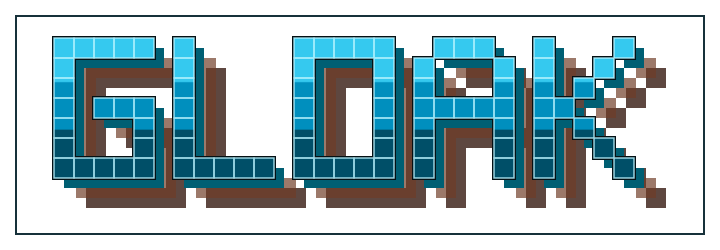

# gloak

<p align="center">
  
</p>


> Go single-binary CLI for age-encrypted, chunked, verified backups.

> [!WARNING]
> gloak is alpha software (`v0.1.0-alpha.1`). Do not use it as your only backup path.
> The storage layout, manifest format, CLI flags, and restore behavior may change without compatibility guarantees.
>
> Use it for testing, non-critical data, or secondary backups only. If you store anything important with gloak, keep another verified backup somewhere else.

gloak splits a file into fixed-size chunks, encrypts each chunk with age, uploads them, and verifies them before restore. Metadata such as filenames, sizes, recipients, and hashes lives inside an age-encrypted manifest. Storage only sees backup IDs, public completion markers, and encrypted chunk objects.

```text
keygen → chunk → encrypt chunks → upload → resume if needed → verify → restore
```

---

## Quick start

```bash
# install dependencies
go mod download

# build standalone binary
go build -o gloak .

# generate keys
./gloak keygen

# encrypt + upload
./gloak upload ./secret.tar --remote myremote:backup_folder

# resume an interrupted upload
./gloak resume <backup-id>

# verify
./gloak verify <backup-id> --remote myremote:backup_folder -i ~/.gloak/identity.txt

# restore
./gloak restore <backup-id> --remote myremote:backup_folder --output-dir ./restored/
```

---

## Why this exists

Most backup tools make at least one tradeoff gloak avoids:

1. Encrypt a single blob. If a network failure hits at byte 47 GB of 50, retrying is painful.
2. Split into chunks without enough integrity metadata. You find corruption during restore, without a manifest to guide repair.
3. Store metadata in plaintext. Filenames, sizes, recipient keys, and chunk hashes are visible to anyone who can read the storage.
4. Pull in rclone, restic rest-server, or S3 libraries when you just need local filesystem or a mounted remote.

gloak keeps the design narrow: age encryption, fixed-size chunks, chunk and payload hashes, resumable uploads, and an encrypted manifest so the storage backend does not see filenames or hashes.

---

## Install

```bash
go mod download
```

Build the standalone binary:

```bash
go build -o gloak .
```

This produces `gloak`, a compiled binary you can put in containers, cron jobs, or VPS root filesystems without installing Node, Bun, or Python.

Run tests:

```bash
go test ./...
```

---

## Key generation

Generate a keypair once:

```bash
./gloak keygen
```

Default location is `~/.gloak/`:

```text
~/.gloak/
  identity.txt      # private key, keep this secret
  recipient.txt     # public key, safe to share
```

Use a custom directory:

```bash
./gloak keygen --output-dir /path/to/keys
./gloak keygen -o /path/to/keys
```

After `keygen` runs once, `-i` (identity) and `-r` (recipient) flags become optional. gloak reads from `~/.gloak/` automatically.

### Key flags

| Flag | Alias | Description |
|------|-------|-------------|
| `-r <file>` | `--recipient` | Recipient public key file. Overrides `~/.gloak/recipient.txt`. |
| `-i <file>` | `--identity` | Identity private key file. Overrides `~/.gloak/identity.txt`. |

---

## Commands

### `setup`: install dependencies

If you don't have `rclone` installed on your system, `gloak setup` will download a standalone, verified binary to `~/.gloak/bin/rclone` so `gloak` can use it without touching your system packages.

```bash
./gloak setup
```

| Option | Alias | Description |
|--------|-------|-------------|
| `--dir <path>` | `-D` | Custom install directory (default: `~/.gloak/bin`). |
| `--update` | `-u` | Force re-download even if `rclone` already exists. |

---

### `upload`: create an encrypted backup

Creates a UUID folder, splits the input into fixed-size plaintext chunks, encrypts each chunk independently with age, records SHA-256 checksums in an age-encrypted manifest, and uploads chunks first. `manifest.age` and `locator.json` are uploaded after the chunks.

Chunks and manifest are encrypted with the same age recipient. Storage sees filenames like `chunk_00000` and `manifest.age` but cannot read filenames, sizes, or hashes without the identity key.

```bash
# using auto-resolved keys
./gloak upload ./backup.tar --remote myremote:backup_folder

# with explicit recipient
./gloak upload ./backup.tar \
  -r /path/to/recipient.txt \
  --remote myremote:backup_folder
```

Output:

```text
Backup ID: 7f91c6c7-7a0b-44aa-ae23-997b60e4e998
Backup completed successfully!
Save this UUID for restoration: 7f91c6c7-7a0b-44aa-ae23-997b60e4e998
```

| Option | Alias | Default | Description |
|--------|-------|---------|-------------|
| `--recipient <key-or-file>` | `-r` | `~/.gloak/recipient.txt` | Recipient public key or recipient file. |
| `--remote` | `-R` | _required_ | Target Rclone destination (e.g. `myremote:backup_folder` or `/mnt/backups`). |

The locator is uploaded last. If the upload is interrupted, the backup directory exists but has no `locator.json`. gloak keeps local state under `~/.gloak/uploads/<backup-id>.json`, which lets `resume` skip chunks that already uploaded cleanly.

---

### `resume`: continue an interrupted upload

Reads local upload state from `~/.gloak/uploads`, scans the source file from the beginning, skips chunks whose plaintext size and SHA-256 still match the saved state, uploads missing chunks, then writes `manifest.age` and `locator.json`.

```bash
./gloak resume 7f91c6c7-7a0b-44aa-ae23-997b60e4e998
```

Resume requires the original source file at the same path with the same size. gloak does not keep plaintext or encrypted payload spool files locally. It stores only the chunk metadata needed to decide which uploaded chunks can be skipped.

---

### `verify`: check backup integrity

Downloads and decrypts `manifest.age`, checks each encrypted chunk size and SHA-256, decrypts each chunk, checks plaintext size and SHA-256, then compares the full plaintext payload hash with the manifest.

```bash
./gloak verify 7f91c6c7-7a0b-44aa-ae23-997b60e4e998 \
  --remote myremote:backup_folder \
  -i ~/.gloak/identity.txt
```

Output on success:

```text
VERIFIED! All chunks are healthy and checksums match 100%.
```

On failure:

```text
CHUNK CORRUPT: Hash chunk_00042 mismatch!
```

| Option | Alias | Description |
|--------|-------|-------------|
| `--identity <file>` | `-i` | Identity private key to decrypt `manifest.age` (defaults to `~/.gloak/identity.txt`). |
| `--remote <uri>` | `-R` | Source Rclone destination (e.g. `myremote:backup_folder` or `/mnt/backups`). |

---

### `restore`: restore a backup

Checks each encrypted chunk, decrypts it, checks the plaintext chunk, then writes the restored file chunk by chunk.

```bash
# with auto-resolved identity
./gloak restore 7f91c6c7-7a0b-44aa-ae23-997b60e4e998 \
  --remote myremote:backup_folder \
  --output-dir ./restored/

# with explicit identity
./gloak restore 7f91c6c7-7a0b-44aa-ae23-997b60e4e998 \
  --remote myremote:backup_folder \
  -i ~/.gloak/identity.txt \
  --output-dir ./restored/
```

`--output-dir` specifies the directory where gloak restores the backup. gloak writes the restored file using the original filename from the decrypted manifest after validating that filename is safe.

| Option | Alias | Description |
|--------|-------|-------------|
| `--identity <file>` | `-i` | Identity private key to decrypt `manifest.age` (defaults to `~/.gloak/identity.txt`). |
| `--remote <uri>` | `-R` | Source Rclone destination (e.g. `myremote:backup_folder` or `/mnt/backups`). |
| `--output-dir <path>` | `-o` | Output directory for restored data. |

Restore rejects:

- Backup IDs that fail UUID v4 validation
- Corrupted or tampered `manifest.age`
- Unsafe filenames in the decrypted manifest (path separators, null bytes, dots only, Windows drive letters)
- Chunks with wrong size or SHA-256

---

### `cleanup`: remove incomplete backups

Scans remote storage for backup directories that are missing `manifest.age`, usually from interrupted uploads, and offers to delete them.

```bash
# interactive prompt before deletion
./gloak cleanup --remote myremote:backup_folder

# skip prompt (useful for cron jobs)
./gloak cleanup --remote myremote:backup_folder --yes
```

| Option | Alias | Description |
|--------|-------|-------------|
| `--remote <uri>` | `-R` | Rclone remote URI (e.g. `myremote:backup_folder`). |
| `--yes` | `-y` | Skip confirmation prompt. |

---

## Storage layout

### filesystem-v1 (current, alpha)

```text
/mnt/backups/
  {backup_id}/
    locator.json          # public completion marker
    manifest.age          # age-encrypted manifest
    chunk_00000           # encrypted chunk (fixed-size)
    chunk_00001
    chunk_00002
```

`locator.json` is a small public file:

```json
{
  "version": "1.0",
  "uuid": "7f91c6c7-7a0b-44aa-ae23-997b60e4e998"
}
```

The locator has no sensitive metadata. It contains no filename, recipient, chunk hashes, or payload hash. Tools can use it to detect backup completion without decrypting anything.

`manifest.age` is the full backup metadata encrypted with age. Once decrypted:

| Field | Contains |
|-------|----------|
| `original_name` | Basename of backed-up file |
| `original_size` | Original file size |
| `recipient` | Age recipient |
| `payload_sha256` | SHA-256 of the full plaintext payload |
| `chunks[].index` | Chunk index (0-based) |
| `chunks[].name` | Chunk filename (e.g. `chunk_00042`) |
| `chunks[].plain_size` | Plaintext chunk byte size |
| `chunks[].plain_sha256` | SHA-256 of plaintext chunk content |
| `chunks[].encrypted_size` | Encrypted chunk byte size |
| `chunks[].encrypted_sha256` | SHA-256 of encrypted chunk content |

## Architecture

```text
├── main.go                     # CLI entrypoint
├── setup.go                    # rclone downloader command
├── keygen.go                   # keygen command definition
├── upload.go                   # upload command definition
├── resume.go                   # resume command definition
├── verify.go                   # verify command definition
├── restore.go                  # restore command definition
├── cleanup.go                  # cleanup command definition
└── internal/
    ├── core/
    │   ├── chunk.go            # fixed-size chunking + hashing
    │   └── manifest.go         # Manifest types + validation
    ├── crypto/
    │   ├── keygen.go           # age keypair generation
    │   └── stream.go           # streaming age encrypt/decrypt wrapper
    ├── flow/
    │   ├── upload.go           # upload workflow logic
    │   ├── resume.go           # resume workflow logic
    │   ├── verify.go           # verification workflow logic
    │   └── restore.go          # restore workflow logic
    └── storage/
        └── rclone.go           # Rclone backend wrapper
```

### Data flow

```text
upload:
  input file → split into plaintext chunks
             → SHA-256 plaintext chunk + full payload
             → age encrypt each chunk
             → SHA-256 encrypted chunk
             → upload chunks → upload manifest.age → upload locator.json

resume:
  upload state → re-read source chunks
               → skip chunks whose plaintext hash still matches state
               → upload missing chunks → upload manifest.age → upload locator.json

verify:
  locator.json → completion marker
              → manifest.age → age decrypt → validate manifest
                                           → check encrypted chunk size/SHA-256
                                           → decrypt each chunk
                                           → check plaintext chunk size/SHA-256
                                           → check full payload SHA-256

restore:
  manifest.age → download encrypted chunk → verify → decrypt chunk → write output
```

### Key design decisions

| Decision | Rationale |
|----------|-----------|
| Recipient-mode age encryption | One identity decrypts. No passphrase to remember or leak. |
| Per-chunk encryption | Each chunk is a standalone age payload, so interrupted uploads can resume without deterministic encryption. |
| Fixed-size chunks | Deterministic boundaries regardless of content. Simplifies verification, resumability, and storage layout. |
| Encrypted manifest | Storage never sees filenames, sizes, or hashes. Only backup UUIDs and chunk object names are visible. |
| Locator uploaded last | If upload is interrupted, no `locator.json` marks the backup complete. |
| Identity required for verify/restore | Manifest is encrypted. You need the identity key to read it. This is a feature, not a bug. |
| SHA-256 at chunk + payload | Corruption is detected before and after decrypting each chunk. |
| Fixed 20MB chunk size | Prevents metadata bloat from tiny chunks and excessive memory usage. |

---

## Not built yet

Deferred intentionally:

| Feature | Reasoning |
|---------|-----------|
| Named storage profiles | `--remote my-backups` instead of typing URIs. |
| Telegram integration | Hermes Agent plugin for backup/restore/verify via Telegram. |
| Per-chunk data keys | Each chunk would use its own data key stored inside the encrypted manifest. This would limit key exposure if a key leaks. |

---

## License

MIT
